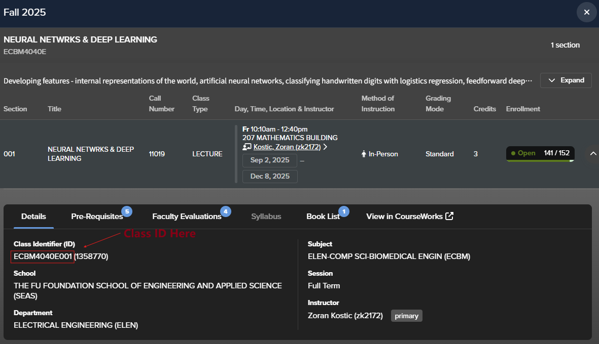

# vergil2ics

A Python script to convert your Columbia University Vergil class schedule into a standard iCalendar (.ics) file, which can be imported into Google Calendar, Outlook, Apple Calendar, and other calendar applications.

If this project helps you keep your schedule organized, please consider giving it a star! ⭐

## Features

*   Fetches class data directly from the Columbia University Vergil API.
*   Generates recurring events for classes with specified start/end dates and weekly schedules.
*   Outputs a `.ics` file compatible with most calendar applications.

## Getting Started

These instructions will get you a copy of the project up and running on your local machine for development and testing purposes.

### Prerequisites

*   Python

### Installation

1.  **Clone the repository:**
    ```bash
    git clone https://github.com/SY-LG/vergil2ics.git
    cd vergil2ics
    ```

2.  **Create and activate a virtual environment (recommended):**
    ```bash
    python -m venv venv
    # On Linux/macOS:
    source venv/bin/activate
    # On Windows:
    .\venv\Scripts\activate
    ```

3.  **Install dependencies:**
    ```bash
    pip install -r requirements.txt
    ```

### Usage

1.  **Identify your `class_id` and `calendar_code`:**

    *   **Class ID:** This is the unique identifier for each course, e.g., `ECBM4040E001`.
        *   **How to get it from Vergil:**
            

            The class ID can usually be found on the Vergil course page, listed as "Course Identifier (ID)". It's the unique alphanumeric string associated with a specific section of a course.

    *   **Calendar Code:** This code represents the semester. For example:
        *   `20253` for Fall 2025
        *   `20261` for Spring 2026
        *   `20262` for Summer 2026

2.  **Edit `main.py`:**
    Open the `main.py` file in the `src` directory. Update the `class_ids` list with your desired class identifiers and set the `CALENDAR_CODE` for the correct semester.

    ```python
    # src/main.py
    class_ids = [
        'YOUR_CLASS_ID_1', # e.g., 'ECBM4040E001'
        # Add more class IDs as needed
    ]
    CALENDAR_CODE = 'YOUR_CALENDAR_CODE'
    ```

3.  **Run the script:**
    From the project root directory, execute:
    ```bash
    python src/main.py
    ```

    A `vergil.ics` file will be generated in the `output/` directory at the project root.

4.  **Import into your calendar:**
    Open your preferred calendar application (Google Calendar, Outlook, Apple Calendar, etc.) and import the `vergil.ics` file.

## Future Plans

A GUI version of this tool is currently under development to make it even easier to use!

## Contributing

Contributions are welcome! If you have suggestions or want to improve the code, please feel free to open an issue or submit a pull request.

## License

This project is licensed under the [MIT License](LICENSE).

---

## Star this project! ⭐

If `vergil2ics` helps you manage your schedule, please show your support by starring the repository on GitHub!